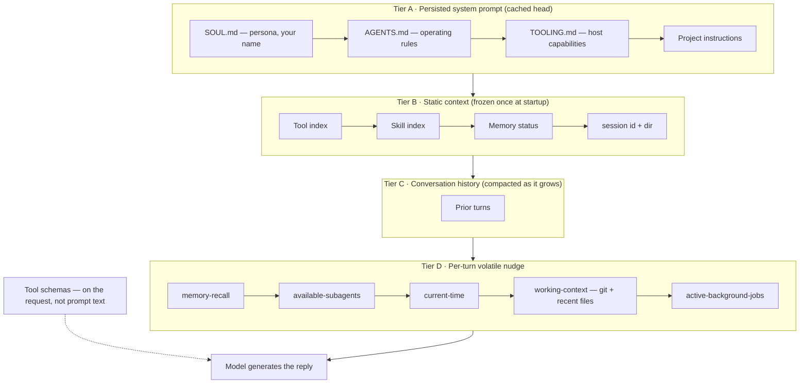

Everything the model sees on a turn is assembled from layers, in a fixed order. Netclaw doesn't hand the model one blob of text — it stacks a persisted system prompt, a frozen block of static context, the conversation history, and a fresh per-turn nudge, then attaches the tool schemas separately on the request.

The order is deliberate, and it's built for [prompt caching](https://www.anthropic.com/news/prompt-caching). The stable material sits at the front so the provider can reuse the cached prefix across turns; the volatile, changes-every-turn material sits at the back near the model's generation point. That's why, for example, the current git state is injected late and your persona sits first.

What each layer contains — and whether it appears at all — depends on the session's [audience](/security/security-model/#trust-audiences). A `Public` turn gets a deliberately thin stack; `Team` and `Personal` get the full one.

## The layers



### Tier A — the persisted system prompt

Built once and stored as the head of the conversation, rebuilt only when its inputs change (byte-identical content is left alone to preserve the cache). Four identity layers, concatenated in order:

| Layer | What it is | Source |
|-------|-----------|--------|
| `SOUL.md` | Persona, tone, your name | `~/.netclaw/SOUL.md` |
| `AGENTS.md` | Operating rules — the built-in core plus your deployment playbook | embedded in netclaw, plus `~/.netclaw/AGENTS.md` |
| `TOOLING.md` | What the host can actually do | `~/.netclaw/TOOLING.md` |
| Project instructions | Repo-specific rules | first of `.netclaw/AGENTS.md`, `CLAUDE.md`, `AGENTS.md`, `CONTEXT.md` in the project directory |

The `AGENTS.md` layer has two halves: an operating core compiled into netclaw (a stripped-down variant on `Public`) and the deployment playbook you write at `~/.netclaw/AGENTS.md`. Project instructions follow the same `AGENTS.md` / `CLAUDE.md` convention other coding tools use, but read from the project directory.

### Tier B — static context, frozen at startup

Rendered once when the session starts and then held byte-stable, so it never breaks the cache prefix mid-conversation:

| Layer | What it is | Empty when |
|-------|-----------|------------|
| Tool index | A compressed, audience-filtered catalog of available tools — for awareness, not invocation | — |
| Skill index | The loaded skill inventory | `Public`, or skills disabled |
| Memory status | Whether the memory subsystem is healthy | `Public`, or memory disabled |
| `[session]` | Session id, plus the session directory for non-`Public` turns | — |
| `[attachment]` hint | How to handle attached files | `file_read` not granted |

The tool index is awareness only. The actual tool **schemas** ride on the request itself (as the provider's tool parameter), resolved and audience-filtered every turn — so a tool has two surfaces: a compressed name in the prompt for discovery, and its full schema on the wire.

### Tier C — conversation history

The turns so far, verbatim. As it grows past the model's budget it gets [compacted](/architecture/sessions/#compaction) into a summary. The durable working context (below) survives compaction; the raw transcript doesn't.

### Tier D — the per-turn volatile nudge

This is the freshest layer, rebuilt every turn. One structural quirk worth knowing: it isn't a trailing system message. Netclaw injects it as a `[system: …]` block wrapped in a **user-role message, placed just before your latest message** — which keeps it inside the cacheable history prefix and sidesteps the "a fresh user turn just started" confusion some models have with trailing system text. Order within it:

| Layer | What it is | Suppressed on `Public` |
|-------|-----------|:----------------------:|
| `[memory-recall]` | Memories recalled for this turn | — |
| Skill hint | A nudge toward a relevant skill | — |
| `[available-subagents]` | Subagents this session can spawn | ✓ |
| `[current-time]` | UTC, local, day, timezone | — |
| `[working-context]` | Git state + project dir + recent files | ✓ |
| `[active-background-jobs]` | Running background work | ✓ |

## Audience scoping

`Public` sessions run untrusted input, so most of the stack is withheld:

| | `Public` | `Team` / `Personal` |
|---|:---:|:---:|
| SOUL.md, AGENTS.md core, tool index, `[current-time]` | ✓ (public AGENTS variant) | ✓ |
| TOOLING.md, project instructions | — | ✓ |
| Skill index, memory, subagents, working-context, background jobs | — | ✓ |
| `[session]` | id only | id + directory |

## Git working context

On `Team` and `Personal` turns where a project directory is set, netclaw derives a live snapshot of your git state and drops it into the volatile nudge as a `[working-context]` block. It's how the model knows what branch you're on and what you've been touching without you spelling it out.

It's computed fresh at the start of every turn by shelling out to `git` — so `git` has to be on the daemon's PATH — under a hard **2-second budget**. Nothing is persisted; the snapshot is rebuilt each turn, and the durable half (project directory and recent files) is what survives compaction and restarts.

What the block actually contains:

- `project_dir` — set via the `set_working_directory` tool.
- `recent_files` — the last 10 files read or written, most-recent first.
- `git:` — `worktree`, `branch` (or `(detached)`), `head`, and `upstream` / `ahead` / `behind` **only when the branch tracks an upstream**, then **counts** of staged, modified, and untracked files.

:::caution
Two things the block does **not** do, despite how it's easy to read the feature:

- **Changed files appear as counts, not names.** The model sees "3 modified", not which three. The individual paths are tracked internally (for subagent handoff) but never rendered into the prompt.
- **There's no per-turn config.** It's fully automatic — no on/off switch, no tunable limits. The 2-second budget, the 256 KB output ceiling, and the 10-file recent list are all fixed.
:::

If git isn't reachable, the run is slow, or the directory isn't a repo, the block degrades to a short `unavailable` note with a reason instead of failing the turn.

## Subagent context

A [subagent](/guides/custom-subagents/) doesn't get a copy of the parent's context. It runs a much thinner stack, assembled fresh for a one-shot task:

```
AGENTS.md operating rules  +  project instructions
  +  the subagent's own markdown body
  +  a headless execution contract
```

What a subagent **inherits** from its parent at spawn time:

- The `AGENTS.md` operating rules and project instructions (audience-appropriate) — so a child plays by the same house rules as the parent.
- The project directory, the recent-files list, and the **same working directory** — there's no worktree isolation; a subagent edits the same files the parent would.
- The parent's [audience](/security/security-model/#trust-audiences), and a tool policy filtered to it — **minus `spawn_agent`**, so subagents can't recursively spawn.
- An initial git snapshot taken at spawn.

What it **doesn't** get: your SOUL.md persona, TOOLING.md, memory recall, the skill or memory indexes, subagent discovery, the `[current-time]` layer, background jobs, or the parent's conversation history. Its entire user message is `Context: … Task: …`.

When a subagent finishes, it hands back a working-context delta. The parent merges **only the files a successful child confirmed it wrote or edited** into its own recent-files list — a failed or cancelled run merges nothing, and files the child only read aren't merged. This is an in-memory recent-files handoff, not a git merge: since parent and child share one working directory, the edits are already on disk. The merge just keeps the parent's sense of "what we've been touching" current.

## Limitations

- The git working context needs `git` on the daemon's PATH and a project directory set; without both, the `[working-context]` block is absent, not an error.
- Changed-file **names** are never exposed to the model — only counts, and only the recent-files list carries specific paths.
- None of the layer sizes are configurable. Recent files cap at 10, git inspection at a 2-second budget.
- Subagents share the parent's working directory. There is no filesystem sandbox between a parent and its subagent beyond the audience's tool policy.

## Related pages

- [Sessions & Input Model](/architecture/sessions/) — the turn lifecycle these layers feed, and compaction
- [Memory Model](/architecture/memory-model/) — how the memory layers (recall, index) are formed and scoped
- [Custom Subagents](/guides/custom-subagents/) — defining the subagents whose context this page describes
- [Security Model](/security/security-model/#trust-audiences) — the audiences that gate each layer

## Resources

- [Prompt caching (Anthropic)](https://www.anthropic.com/news/prompt-caching) — why the stable-prefix ordering matters
- [AGENTS.md](https://agents.md/) — the operating-rules file convention netclaw follows for project instructions
