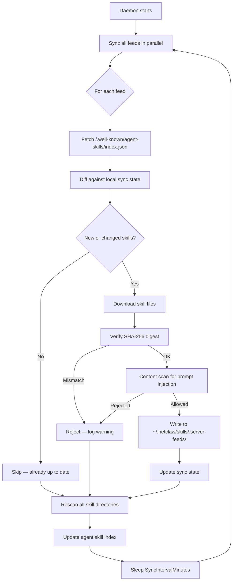

Skill feeds connect your netclaw daemon to private skill servers. The daemon discovers available skills via the [Cloudflare Agent Skills Discovery RFC](https://github.com/cloudflare/agent-skills-discovery-rfc) protocol, downloads them, verifies integrity via SHA-256 digests, and makes them available to the agent — all automatically.

Skills follow the [AgentSkills.io](https://agentskills.io) open standard format. Both standards are vendor-neutral and supported across multiple agent platforms, so skills published to a feed work anywhere that speaks the protocol.

## How It Works



Each feed syncs independently. A failing server never blocks other feeds or daemon startup. On failure, the daemon falls back to on-disk skills from the last successful sync.

## Add a Feed via netclaw config

The `netclaw config` → Skill Sources screen lets you add remote skill servers. Select "+ Add skill server," enter the base URL, and the daemon probes for `/.well-known/agent-skills/index.json`, reports the skill count (or shows the error), and suggests a name based on the hostname. If the server requires authentication, you'll be prompted for a bearer token. Add as many feeds as you need.


The Skill Sources screen — choose **+ Add skill server** to add a remote feed by base URL.

Each remote server in the list shows how many skills it **advertises** — the count from its `index.json`, rendered as `N advertised` on the server's row. That's what the server publishes, not necessarily what netclaw loads: the daemon can end up with fewer after content-scanning, hashing, and version filtering. A gap between "advertised" and what shows up in `netclaw skill list` is normal, not an error.

## Manual Configuration

Remote feeds can only be added through `netclaw config` → Skill Sources, or by editing `~/.netclaw/config/netclaw.json` directly:

```json
{
  "SkillFeeds": {
    "SyncIntervalMinutes": 60,
    "Feeds": [
      {
        "Name": "corp-skills",
        "Url": "https://skills.corp.com",
        "Enabled": true,
        "TimeoutSeconds": 30
      }
    ]
  }
}
```

## Feed Config Fields

| Field | Type | Default | Description |
|-------|------|---------|-------------|
| `Name` | string | — | Filesystem-safe identifier for this feed |
| `Url` | string | — | Base URL; daemon appends `/.well-known/agent-skills/index.json` |
| `Enabled` | bool | `true` | Toggle without removing the entry |
| `TimeoutSeconds` | int | `30` | HTTP timeout for this feed |
| `ApiKey` | string | `null` | Optional bearer token for authenticated feeds; supports the `ENC:` prefix for encrypted storage |

Top-level `SkillFeeds` settings:

| Field | Default | Description |
|-------|---------|-------------|
| `SyncIntervalMinutes` | `60` | Periodic sync interval. Set to `0` for startup-only sync. |

## Sync Behavior

- **Startup sync** runs immediately with no jitter. Network failures are logged but never block the daemon from starting.
- **Periodic sync** fires every `SyncIntervalMinutes`. The first periodic tick adds 0-5 minutes of random jitter to stagger multiple instances hitting the same server.
- **Startup-only mode**: set `SyncIntervalMinutes: 0` to disable periodic sync entirely. Skills only update when the daemon restarts.
- **Isolation**: each feed syncs in its own background task. One slow or broken server has zero impact on the others.
- **Fallback**: on any failure, the daemon keeps serving the last successfully synced skills from disk.

## Writing Skills for a Feed

Any skill server publishes skills that follow the [AgentSkills.io](https://agentskills.io) format. Here's what you need to know.

### Directory Layout

```
my-skill/
  SKILL.md          # Required
  references/       # Optional — reference material
  scripts/          # Optional — helper scripts
  assets/           # Optional — images, templates
```

### SKILL.md Format

```yaml
---
name: deploy-staging
description: Deploy the current branch to the staging environment.
version: 1.2.0
category: devops
allowed-tools: "bash docker"
---

# Deploy to Staging

Prerequisites:
- Docker CLI authenticated to the registry
- VPN connected to staging network

## Steps

1. Build the container image
2. Push to the staging registry
3. Trigger the deployment webhook
```

### Frontmatter Fields

| Field | Required | Description |
|-------|----------|-------------|
| `name` | Yes | 1-64 chars, lowercase alphanumeric + hyphens (`^[a-z0-9]+(-[a-z0-9]+)*$`) |
| `description` | Yes | One-line summary visible to agents during discovery |
| `version` | Yes (for feeds) | [Semver](https://semver.org) string — bumping triggers a new publish |
| `category` | No | Aids search and filtering |
| `license` | No | [SPDX identifier](https://spdx.org/licenses/) |
| `compatibility` | No | Which agent platforms can use this |
| `allowed-tools` | No | Space-delimited tool list (informational only, does not grant access) |
| `invocable` | No | Default `true`; `false` hides from slash commands |
| `disable-model-invocation` | No | `true` excludes from LLM index (still invocable via `/name`) |
| `argument-hint` | No | Hint shown after the slash command name |
| `metadata.subagent` | No | Routes to a named subagent instead of returning content |

The `version` field is required for feed publishing. The server uses it to detect changes — bump the version to trigger downstream syncs.

## Security

Every skill downloaded from a feed goes through the content scanner before it reaches the agent:

| Verdict | Action |
|---------|--------|
| **Allowed** | Skill proceeds normally |
| **Warning** | Skill loads, event is logged |
| **Rejected** | Skill blocked; surfaces in `netclaw skill issues` |

Resource files (`references/`, `scripts/`) are also scanned. SHA-256 digest verification runs before scanning — a tampered file is rejected before the content scanner even sees it.

Server feed skills are stored as read-only in `~/.netclaw/skills/.server-feeds/{feed-name}/`. They cannot be modified locally.

### Precedence

```
native skills  >  server feeds  >  external sources
```

A native skill with the same name always wins. To override a feed skill, create a native skill with the same `name` — your local version takes priority.

### Disabling All Skills

Two related config keys control broader skill behavior:

| Key | Effect |
|-----|--------|
| `SkillSync.Enabled: false` | Blocks the agent from loading *any* skills via `skill_load` |
| `SkillSync.DisableSystemSkillSync: false` | Set `true` to disable the built-in CDN feed; the default `false` keeps it enabled (separate from private feeds) |

## Troubleshooting

### Feed shows 0 skills after adding

Open `netclaw config` → Skill Sources to confirm the feed is enabled, or check `~/.netclaw/config/netclaw.json` under the `SkillFeeds.Feeds` array. Then check the daemon logs — the most common cause is the server not serving `/.well-known/agent-skills/index.json` at the expected path. Verify with:

```bash
curl -s https://skills.corp.com/.well-known/agent-skills/index.json | head
```

### Skills not updating

Periodic sync fires every `SyncIntervalMinutes` (default 60). If you need immediate updates, restart the daemon — startup sync runs without delay. Also check that the skill's `version` was bumped on the server side.

### "Content rejected" in skill issues

The content scanner flagged prompt injection patterns in the skill body. Run `netclaw skill issues` for details. Work with the skill author to revise the content, or file an issue on the skill server if you believe it's a false positive.


## Related Pages

- [Skills Overview](/skills/overview/) — format, lifecycle, and precedence rules
- [External Skills](/skills/external-skills/) — local skill directories from other tools
- [Skill Server](/skills/skill-server/) — running your own server that publishes feeds
- [`netclaw skill`](/cli/skill/) — CLI reference for skill management

## External Resources

- [AgentSkills.io](https://agentskills.io) — the SKILL.md format specification
- [Cloudflare Agent Skills Discovery RFC v0.2.0](https://github.com/cloudflare/agent-skills-discovery-rfc) — the discovery protocol behind skill feeds
- [netclaw-dev/skill-server](https://github.com/netclaw-dev/skill-server) — reference implementation of a private skill server
